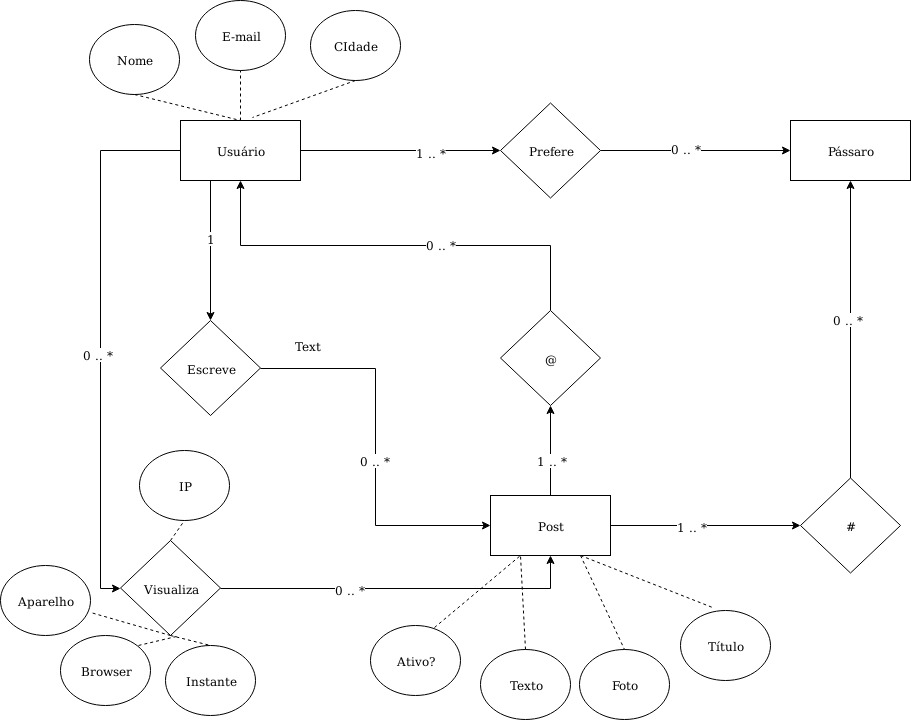
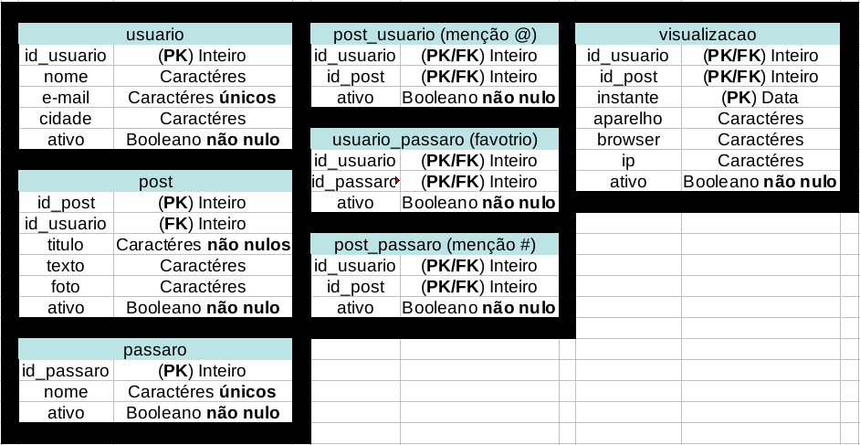

# Bird Watching

Um mock de uma rede social de observadores de pássaros.

## Modelo de entidade relacionamento da base de dados:

## Diagrama do modelo relacional:

## Dicionário de dados:

### Usuario

| NOME | DESCRICAO | AUTO-GERADA? | PK OU FK? | RESTRICOES? |
| --- | --- | --- | --- | --- |
| id_usuario | id do usuário | Sim, auto_increment | PK | not null |
| nome | nome de usuário | não | não | unique |
| email | email do usuário | não | não | não |
| cidade | cidade onde mora | não | não | não |
| ativo | quando 1 indica delete lógico | não | não | não |

### Post

NOME | DESCRICAO | AUTO-GERADA? | PK OU FK? | RESTRICOES
--- | --- | --- | --- | --- | ---
ip | De qual ip que veio a requisicao | nao |sim |nao | nao nulo
aparelho | Em qual aparelho que foi feita a requisicao | nao |sim  |nao| nao nulo
navegador | Em qual navegador foi feita a requisicao | nao |sim |nao | nao nulo
IDUSUARIO | O Id para a representacao do usuario no banco de dados | nao |sim  |sim (Usuario)| nao
timestamp | Qual a data da requisicao | sim (timestamp default) |sim |nao | nao

### Passaro

NOME | DESCRICAO | AUTO-GERADA? | PK OU FK? | RESTRICOES
--- | --- | --- | --- | --- | ---
ip | De qual ip que veio a requisicao | nao |sim |nao | nao nulo
aparelho | Em qual aparelho que foi feita a requisicao | nao |sim  |nao| nao nulo
navegador | Em qual navegador foi feita a requisicao | nao |sim |nao | nao nulo
IDUSUARIO | O Id para a representacao do usuario no banco de dados | nao |sim  |sim (Usuario)| nao
timestamp | Qual a data da requisicao | sim (timestamp default) |sim |nao | nao

### Vizualizacao

NOME | DESCRICAO | AUTO-GERADA? | PK OU FK? | RESTRICOES
--- | --- | --- | --- | --- | ---
ip | De qual ip que veio a requisicao | nao |sim |nao | nao nulo
aparelho | Em qual aparelho que foi feita a requisicao | nao |sim  |nao| nao nulo
navegador | Em qual navegador foi feita a requisicao | nao |sim |nao | nao nulo
IDUSUARIO | O Id para a representacao do usuario no banco de dados | nao |sim  |sim (Usuario)| nao
timestamp | Qual a data da requisicao | sim (timestamp default) |sim |nao | nao

### Usuario_passaro (favorito)

NOME | DESCRICAO | AUTO-GERADA? | PK OU FK? | RESTRICOES
--- | --- | --- | --- | --- | ---
ip | De qual ip que veio a requisicao | nao |sim |nao | nao nulo
aparelho | Em qual aparelho que foi feita a requisicao | nao |sim  |nao| nao nulo
navegador | Em qual navegador foi feita a requisicao | nao |sim |nao | nao nulo
IDUSUARIO | O Id para a representacao do usuario no banco de dados | nao |sim  |sim (Usuario)| nao
timestamp | Qual a data da requisicao | sim (timestamp default) |sim |nao | nao

### Post_usuario (menção @)

NOME | DESCRICAO | AUTO-GERADA? | PK OU FK? | RESTRICOES
--- | --- | --- | --- | --- | ---
ip | De qual ip que veio a requisicao | nao |sim |nao | nao nulo
aparelho | Em qual aparelho que foi feita a requisicao | nao |sim  |nao| nao nulo
navegador | Em qual navegador foi feita a requisicao | nao |sim |nao | nao nulo
IDUSUARIO | O Id para a representacao do usuario no banco de dados | nao |sim  |sim (Usuario)| nao
timestamp | Qual a data da requisicao | sim (timestamp default) |sim |nao | nao

### Post_passaro (tag #)

NOME | DESCRICAO | AUTO-GERADA? | PK OU FK? | RESTRICOES
--- | --- | --- | --- | --- | ---
ip | De qual ip que veio a requisicao | nao |sim |nao | nao nulo
aparelho | Em qual aparelho que foi feita a requisicao | nao |sim  |nao| nao nulo
navegador | Em qual navegador foi feita a requisicao | nao |sim |nao | nao nulo
IDUSUARIO | O Id para a representacao do usuario no banco de dados | nao |sim  |sim (Usuario)| nao
timestamp | Qual a data da requisicao | sim (timestamp default) |sim |nao | nao

### Joinha

NOME | DESCRICAO | AUTO-GERADA? | PK OU FK? | RESTRICOES
--- | --- | --- | --- | --- | ---
ip | De qual ip que veio a requisicao | nao |sim |nao | nao nulo
aparelho | Em qual aparelho que foi feita a requisicao | nao |sim  |nao| nao nulo
navegador | Em qual navegador foi feita a requisicao | nao |sim |nao | nao nulo
IDUSUARIO | O Id para a representacao do usuario no banco de dados | nao |sim  |sim (Usuario)| nao
timestamp | Qual a data da requisicao | sim (timestamp default) |sim |nao | nao

Informações adicionais:

Todos os PKs que não são FKs são auto-gerados por AUTO_INCREMENT, além de possuirem a restrição NOT NULL

O campo instante na visualização é auto-gerado por timestamp

Todas as tabelas possuem o campo ativo, que representa um delete lógico
