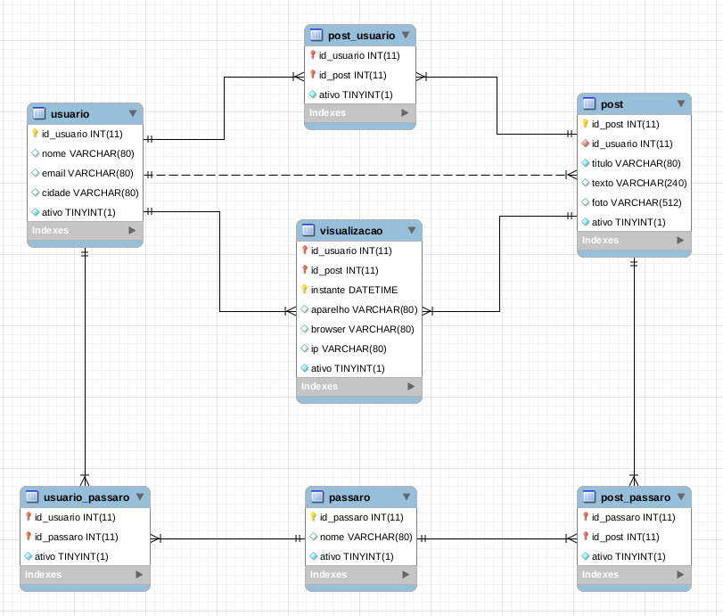
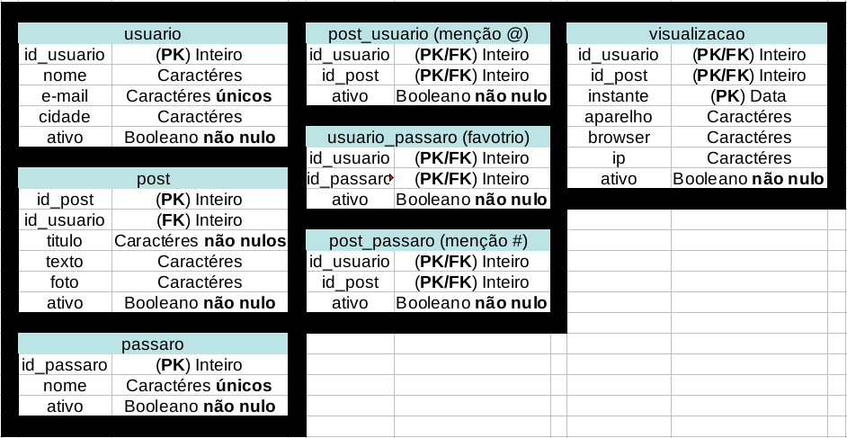

# Bird Watching

Um mock de uma rede social de observadores de pássaros.

Na primeira imagem temos o modelo de entidade relacionamento da base de dados:

Na segunda imagem temos o diagrama do modelo relacional:

Por fim temos o dicionário de dados para melhor compreensão:

Informações adicionais:

Todos os PKs que não são FKs são auto-gerados por AUTO_INCREMENT, além de possuirem a restrição NOT NULL

O campo instante na visualização é auto-gerado por timestamp

Todas as tabelas possuem o campo ativo, que representa um delete lógico
