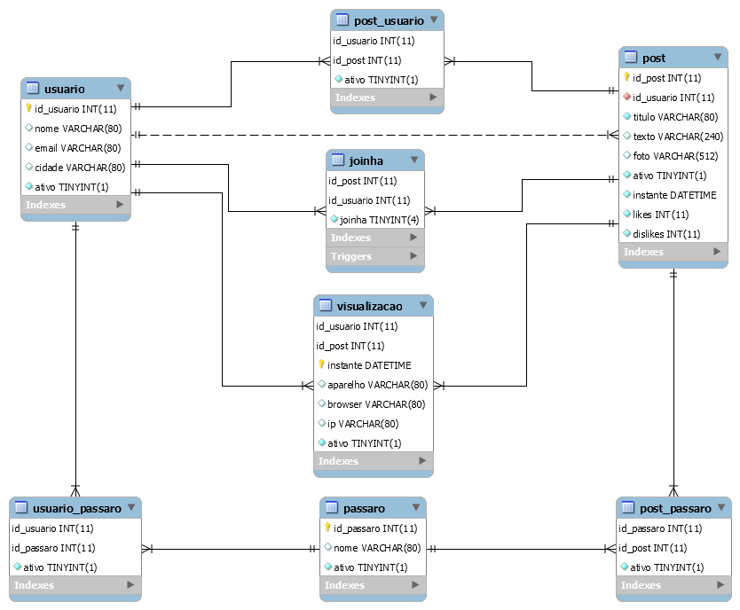

# Bird Watching

Um mock de uma rede social de observadores de pássaros.

## Modelo de entidade relacionamento da base de dados:

## Diagrama do modelo relacional:

## Dicionário de dados:

### Usuario

| NOME | DESCRIÇÃO | AUTO-GERADA? | PK OU FK? | RESTRIÇÕES? |
| --- | --- | --- | --- | --- |
| id_usuario | id do usuário | sim, auto_increment | PK | not null |
| nome | nome de usuário | não | não | unique |
| email | email do usuário | não | não | não |
| cidade | cidade onde mora | não | não | não |
| ativo | binário, quando 0 indica delete lógico | não | não | not null |

### Post

| NOME | DESCRIÇÃO | AUTO-GERADA? | PK OU FK? | RESTRIÇÕES? |
| --- | --- | --- | --- | --- |
| id_post | id do post | sim, auto_increment | PK | not null |
| id_usuario | id do usuário | não | FK (usuario) | not null |
| titulo | título do post | não | não | not null |
| texto | texto do post | não | não | não |
| foto | URL da imagem | não | não | não |
| ativo | binário, quando 0 indica delete lógico | não | não | not null |
| instante | data e hora da criação do post | sim, timestamp | não | not null |
| likes | número de likes da postagem | não | não | not null |
| dislikes | número de dislikes da postagem | não | não | not null |

Essa tabela possui a restrição UNIQUE(id_usuario, titulo, texto)

### Passaro

| NOME | DESCRIÇÃO | AUTO-GERADA? | PK OU FK? | RESTRIÇÕES? |
| --- | --- | --- | --- | --- |
| id_passaro | id do pássaro | sim, auto_increment | PK | not null |
| nome | nome do pássaro | não | não | UNIQUE |
| ativo | binário, quando 0 indica delete lógico | não | não | not null |

### Vizualizacao

| NOME | DESCRIÇÃO | AUTO-GERADA? | PK OU FK? | RESTRIÇÕES? |
| --- | --- | --- | --- | --- |
| id_usuario | id do usuário | não | PK e FK (usuario) | not null |
| id_post | id do post | não | PK e FK (post) | not null |
| instante | data e hora da visualização | sim, timestamp | não | not null |
| aparelho | aparelho usado para o acesso | não | não | não |
| browser | browser usado para o acesso | não | não | não |
| ip | ip do aparelho | não | não | não |
| ativo | binário, quando 0 indica delete lógico | não | não | not null |

### Usuario_passaro (favorito)

| NOME | DESCRIÇÃO | AUTO-GERADA? | PK OU FK? | RESTRIÇÕES? |
| --- | --- | --- | --- | --- |
| id_usuario | id do usuário | não | PK e FK (usuario) | not null |
| id_passaro | id do pássaro | não | PK e FK (post) | not null |
| ativo | binário, quando 0 indica delete lógico | não | não | not null |

Essa tabela possui a restrição UNIQUE(id_usuario, id_passaro)

### Post_usuario (menção @)

| NOME | DESCRIÇÃO | AUTO-GERADA? | PK OU FK? | RESTRIÇÕES? |
| --- | --- | --- | --- | --- |
| id_post | id do post | não | PK e FK (post) | not null |
| id_usuario | id do usuário | não | PK e FK (usuario) | not null |
| ativo | binário, quando 0 indica delete lógico | não | não | not null |

Essa tabela possui a restrição UNIQUE(id_post, id_usuario)

### Post_passaro (tag #)

| NOME | DESCRIÇÃO | AUTO-GERADA? | PK OU FK? | RESTRIÇÕES? |
| --- | --- | --- | --- | --- |
| id_post | id do post | não | PK e FK (post) | not null |
| id_passaro | id do pássaro | não | PK e FK (passaro) | not null |
| ativo | binário, quando 0 indica delete lógico | não | não | not null |

Essa tabela possui a restrição UNIQUE(id_post, id_passaro)

### Joinha

| NOME | DESCRIÇÃO | AUTO-GERADA? | PK OU FK? | RESTRIÇÕES? |
| --- | --- | --- | --- | --- |
| id_post | id do post | não | PK e FK (post) | not null |
| id_usuario | id do usuário | não | PK e FK (usuario) | not null |
| joinha | 0: dislike, 1: like, 2: delete lógico | não | não | not null e between (0 and 2) |
| ativo | binário, quando 0 indica delete lógico | não | não | not null |

Essa tabela possui a restrição UNIQUE(id_post, id_usuario)

## A funcionalidade extra da base de dados é a atualização do like e do dislike nos posts conforme a tabela joinha mudar
